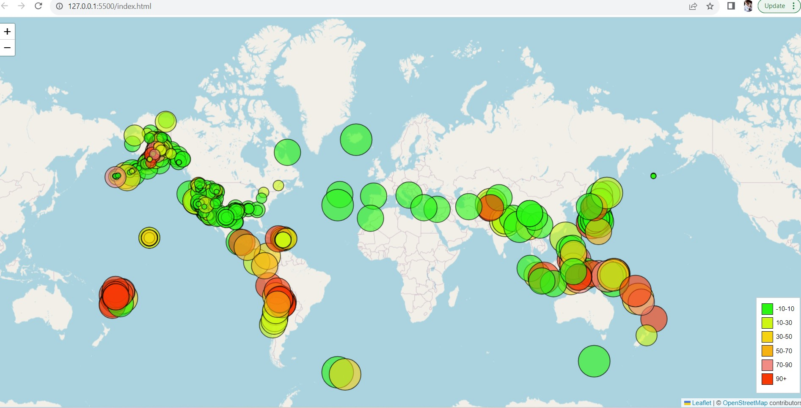

# leaflet-challenge
Week 15 Challenge
help and support

stack overflows small queries

ask your classmates

Dataset created by the United States Geological: https://earthquake.usgs.gov/earthquakes/feed/v1.0/geojson.php

Background

The United States Geological Survey, or USGS for short, is responsible for providing scientific data about natural hazards, the health of our ecosystems and environment, and the impacts of climate and land-use change. Their scientists develop new methods and tools to supply timely, relevant, and useful information about the Earth and its processes.

The USGS is interested in building a new set of tools that will allow them to visualise their earthquake data. They collect a massive amount of data from all over the world each day, but they lack a meaningful way of displaying it. In this challenge, you have been tasked with developing a way to visualise USGS data that will allow them to better educate the public and other government organisations (and hopefully secure more funding) on issues facing our planet.

Part 1: Create the Earthquake Visualisation

